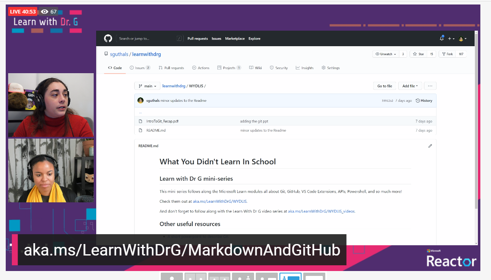

# What You Didn't Learn In School
## Learn with Dr G mini-series

This mini-series follows along the Microsoft Learn modules all about Git, GitHub, VS Code Extensions, APIs, Powershell, and so much more!

Check them out at [aka.ms/LearnWithDrG/WYDLIS](https://aka.ms/LearnWithDrG/WYDLIS).

And don't forget to follow along with the Learn With Dr G video series at [aka.ms/LearnWithDrG/WYDLIS_videos](https://aka.ms/LearnWithDrG/WYDLIS_videos).

## Other useful resources

- [A short powerpoint to describe Git](https://github.com/sguthals/learnwithdrg/blob/main/WYDLIS/IntroToGit_Recap.pdf).

## Examples

Wanted to show an example of adding in a picture in Markdown.

Here is another example:

